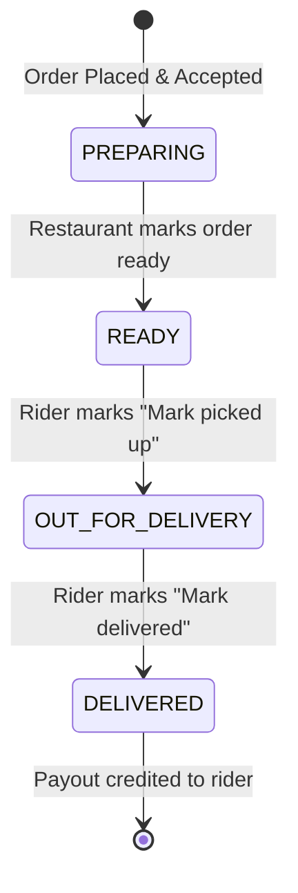

# 🚴 FoodFlow - Delivery Partner Panel & Rider Web App

A modern, responsive, mobile-first Web Application and Progressive Web App (PWA) built for **FoodFlow** delivery partners. This app enables riders to authenticate seamlessly, manage their online availability, handle active food delivery orders, broadcast real-time GPS location coordinates, and track daily and lifetime earnings.

---

## 📑 Table of Contents
1. [Overview & Features](#-overview--features)
2. [Tech Stack & Architecture](#-tech-stack--architecture)
3. [App UI & Screens Breakdown](#-app-ui--screens-breakdown)
   - [1. Authentication & OTP Login](#1-authentication--otp-login)
   - [2. Topbar & Rider Header](#2-topbar--rider-header)
   - [3. Availability Switcher](#3-availability-switcher)
   - [4. Live GPS Location Card](#4-live-gps-location-card)
   - [5. Quick Stats Dashboard](#5-quick-stats-dashboard)
   - [6. Active Deliveries Tab](#6-active-deliveries-tab)
   - [7. Earnings & Payouts Tab](#7-earnings--payouts-tab)
   - [8. Delivery History Tab](#8-delivery-history-tab)
4. [Order Lifecycle & State Transitions](#-order-lifecycle--state-transitions)
5. [Real-time GPS Tracking Engine](#-real-time-gps-tracking-engine)
6. [API Specifications](#-api-specifications)
7. [Getting Started & Local Development](#-getting-started--local-development)

---

## 🌟 Overview & Features

- **📱 Mobile-First Interface**: Crafted with a native app feel optimized for one-handed operation on mobile screens.
- **🔐 Phone + OTP Authentication**: Instant sign-in via registered phone number with automatic 30s resend cooldown.
- **🟢 Availability Management**: Toggle online/offline status to start receiving orders or take a break.
- **📦 Single-Touch Order Dispatch**:
  - Direct call shortcuts to restaurant and customer.
  - Clear Pickup and Drop address cards.
  - Cash on Delivery (COD) collection alerts.
  - Customer handover preferences (*"Leave at door"*, *"Don't ring bell"*, custom instructions).
- **🛰️ Smart GPS Sharing**: Low-battery, throttled GPS location updates to backend with automatic pickup activation and offline recovery.
- **💵 Instant Earnings Ledger**: Per-delivery payout tracking, daily totals, and historical earnings.

---

## 🏗️ Tech Stack & Architecture

```
delivery-panel/
├── frontend/
│   ├── src/
│   │   ├── components/
│   │   │   └── LocationCard.jsx       # Real-time GPS status and control card
│   │   ├── context/
│   │   │   └── RiderContext.jsx       # State management, API helper, 20s heartbeat
│   │   ├── hooks/
│   │   │   └── useLocationSharing.js  # Geolocation watcher with rate limiting & backoff
│   │   ├── views/
│   │   │   ├── LoginView.jsx          # Phone & 6-digit OTP verification screen
│   │   │   └── DashboardView.jsx      # Rider working screen, tabs, and actions
│   │   ├── App.jsx                    # Root app switcher (Auth vs Dashboard)
│   │   ├── main.jsx                   # React entry point
│   │   └── index.css                  # Modern responsive design system
│   ├── index.html
│   ├── package.json
│   └── vite.config.js
└── FoodFlow_Delivery_Panel_Postman_Collection.json
```

- **Frontend Framework**: React 18, Vite
- **Icons**: Lucide React
- **Styling**: Vanilla CSS (Tailored HSL design system, dark/light cards, micro-animations)
- **State Management**: React Context (`RiderContext`) with `localStorage` token persistence and 20s background polling
- **Location Streaming**: Browser Geolocation API (`watchPosition`) with intelligent distance/time throttling

---

## 📱 App UI & Screens Breakdown

### 1. Authentication & OTP Login
- **Mobile Number Step**: 10-digit Indian phone number formatting (`+91 98765 43210`), quick validation.
- **OTP Verification Step**: 6-digit code entry with auto-focus, countdown timer, resend button, and development test-code display.

### 2. Topbar & Rider Header
- **Branded Wordmark**: `FoodFlow` logo.
- **Actions**:
  - 🔄 **Refresh button** (with spinning animation during sync).
  - 🚪 **Sign out button** (invalidates JWT and cleans up location watches).

### 3. Availability Switcher
- Displays **Rider Name**, **Partner Code**, and **Registered Vehicle**.
- Status Badge:
  - 🟢 **Online**: Active and receiving deliveries.
  - ⚪ **Offline**: On break / not receiving orders.
  - 🔒 **On Delivery**: Locked while holding an active food delivery.

### 4. Live GPS Location Card
- Shows GPS status: `Broadcasting`, `Connecting`, or `Stopped`.
- Displays accuracy in meters, current speed in km/h, and time since last sync.
- Auto-starts when the rider marks an order as **Picked Up**.

### 5. Quick Stats Dashboard
Three high-level cards showing immediate progress:
1. **Today's Deliveries**: Completed delivery count.
2. **Earned Today**: Accumulated daily earnings (e.g., `₹250`).
3. **Lifetime Trips & Total**: Lifetime payouts earned on the platform.

### 6. Active Deliveries Tab
Displays active orders prioritized by urgency:
1. `OUT_FOR_DELIVERY` (On the road to customer).
2. `READY` (Ready at kitchen for pickup).
3. `PREPARING` / `ACCEPTED` (Cooking at restaurant).

**Card Content per Order:**
- Order ID (e.g., `#FF-1042`) and total price.
- **Cash on Delivery Alert** (if cash collection is needed at the door).
- **Restaurant Pickup Point**: Restaurant name, full address, and one-tap `Call Restaurant` button.
- **Customer Drop Point**: Customer name, address, and one-tap `Call Customer` button.
- **Special Delivery Preferences**:
  - Handover style (*Hand to me* / *Leave at door*).
  - Contact method (*Call on arrival* / *Message*).
  - Do not ring bell badge.
  - Custom customer note.
- **Item Summary**: Items list with quantities.
- **Big Action Button**:
  - When `READY` ➡️ **"Mark Picked Up"**
  - When `OUT_FOR_DELIVERY` ➡️ **"Mark Delivered"**

### 7. Earnings & Payouts Tab
- Payout rate per delivery (e.g., `₹50 per trip`).
- Total lifetime payouts and trip counters.
- **Recent Payouts Ledger**: Itemized list of completed orders with delivery timestamp and `+₹50.00` credit indicators.

### 8. Delivery History Tab
- Complete past trips record.
- Green checkmark for `DELIVERED` orders with payout value.
- Red badge for `CANCELLED` orders.

---

## 🔄 Order Lifecycle & State Transitions



---

## 🛰️ Real-time GPS Tracking Engine

The location engine (`useLocationSharing.js`) ensures accurate tracking while conserving battery:
- **Rate Limit**: Max 1 request every **10 seconds** or when the rider moves **> 25 meters**.
- **Minimum Gap**: Respects the backend floor limit of **5.5 seconds**.
- **Heartbeat & Resync**: Refreshes stationary coordinates every **45 seconds**.
- **Error Recovery**: Exponential backoff on poor connectivity.
- **Auto Clean**: Stops streaming immediately when the delivery is marked as delivered or rider logs out.

---

## 🔌 API Specifications

| Method | Endpoint | Description |
| :--- | :--- | :--- |
| `POST` | `/api/delivery/auth/send-otp` | Request 6-digit login OTP |
| `POST` | `/api/delivery/auth/verify-otp` | Verify OTP and obtain JWT `token` |
| `POST` | `/api/delivery/auth/logout` | End session & delete active GPS fix |
| `GET` | `/api/delivery/me` | Fetch rider profile & current status |
| `PUT` | `/api/delivery/availability` | Update `ONLINE` / `OFFLINE` status |
| `GET` | `/api/delivery/orders?scope=active` | Get active delivery orders |
| `GET` | `/api/delivery/orders?scope=history` | Get past delivered / cancelled orders |
| `PUT` | `/api/delivery/orders/:id/status` | Advance status (`OUT_FOR_DELIVERY`, `DELIVERED`) |
| `GET` | `/api/delivery/location` | Get live tracking status |
| `PUT` | `/api/delivery/location` | Push latest GPS coordinates (`lat`, `lng`, `speed`, `heading`) |
| `DELETE`| `/api/delivery/location` | Stop sharing location |
| `GET` | `/api/delivery/earnings` | Fetch payout rates, today's summary & recent ledger |

---

## 💻 Getting Started & Local Development

### 1. Prerequisites
- Node.js (v18 or higher)
- npm or yarn

### 2. Installation & Running
```bash
# Navigate to frontend directory
cd frontend

# Install dependencies
npm install

# Start development server
npm run dev
```

### 3. Testing with Postman
Import the included [FoodFlow_Delivery_Panel_Postman_Collection.json](./FoodFlow_Delivery_Panel_Postman_Collection.json) into Postman to test all endpoints.
